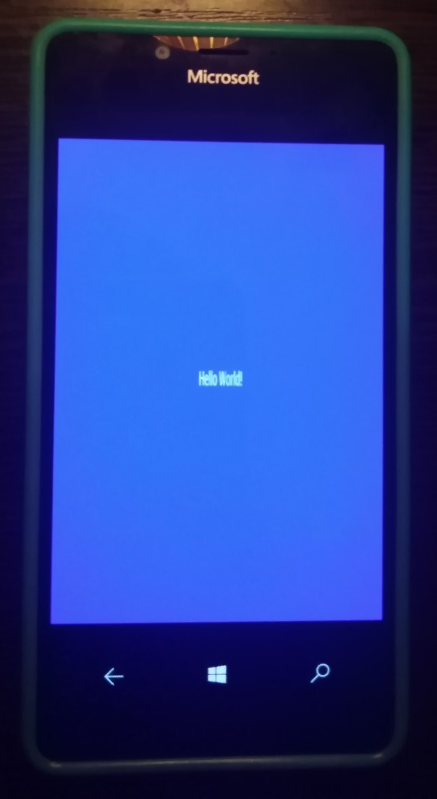
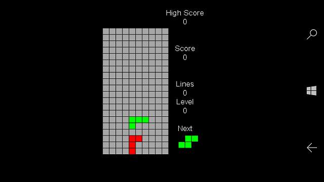

# Cocos2D-Mono.UWP
My fork of [Cocos2D-Mono](https://github.com/brandmooffin/cocos2d-mono/).

## About
Cocos2D-Mono focuses more on the MonoGame Framework and removes the limitations from proper XNA which held the original Cocos2D-XNA project back.

I fix the problem that UWP sample not compiled normally for W10M target (reason: min. os build must be >=16299).

## Screenshots

# Build Status
UWP: W10M with min. os build 15063 now supported. All Cocos2D-Mono adapted for this requaronments.

# Supported Platforms (I leave this content for my future "multiplatform" needs/purposes)
The Cocos2D supports a great list of platforms across the desktop, mobile, and console space:  
 * Desktop PCs
   * Windows 10 Store Apps (UWP)
   * Windows Win32 (OpenGL & DirectX)
   * Linux (OpenGL)
   * macOS (OpenGL)
 * Mobile/Tablet Devices
   * Android (OpenGL)
   * iOS (OpenGL)
   * Windows Phone 10 (UWP)
 * Consoles 
   * Xbox One (UWP)
 * Coming Soon
   * iOS (Metal)
   * tvOS (Metal)
   * macOS (Metal)
   * Xbox One (XDK)
   * Nintendo Switch
   * PlayStation Vita
   * PlayStation 4
   

# Download and Run
To obtain the code you will need a git client.  Either command line or graphical.

Using the git command line you will need to clone the git repository.

> $ git clone https://github.com/mediaexplorer/cocos2d-mono.UWP.git

Wait until the clone has finished.

You should see something similar to the following:

	Cloning into 'cocos2d-mono.UWP'...
	remote: Counting objects: 20553, done.
	remote: Compressing objects: 100% (7677/7677), done.
	remote: Total 20553 (delta 14127), reused 18870 (delta 12446)
	Receiving objects: 100% (20553/20553), 100.83 MiB | 634 KiB/s, done.
	Resolving deltas: 100% (14127/14127), done.
	Checking out files: 100% (4130/4130), done.

You now have everything you need to start start developing with Cocos2D-Mono :)

## Tech Note
Cocos2D-Mono is currently built with MonoGame Framework 3.8 and included as a nuget package, so no need to pull the MonoGame source code! (Unless you want to anyways, then go for it)

## Getting Started : My UWP Sample as Your Game Template
W10M-adapted "Hello world" mono-sample is [here](https://github.com/mediaexplorer74/cocos2d-mono.Uwp/tree/main/Samples/Uwp/)

W10M-adapted "Tetris" multi-sample is [here](https://github.com/mediaexplorer74/cocos2d-mono.Uwp/tree/main/Samples/TetrisGame/)

Feel free to clone it and dev your own little cocos2d-compatible game for Windows 10 Mobile os! 

## Referencies
https://github.com/brandmooffin/cocos2d-mono/  Cocos2D-Mono

## ..
AS IS. No support. RnD only.

## .
[m][e] 2022